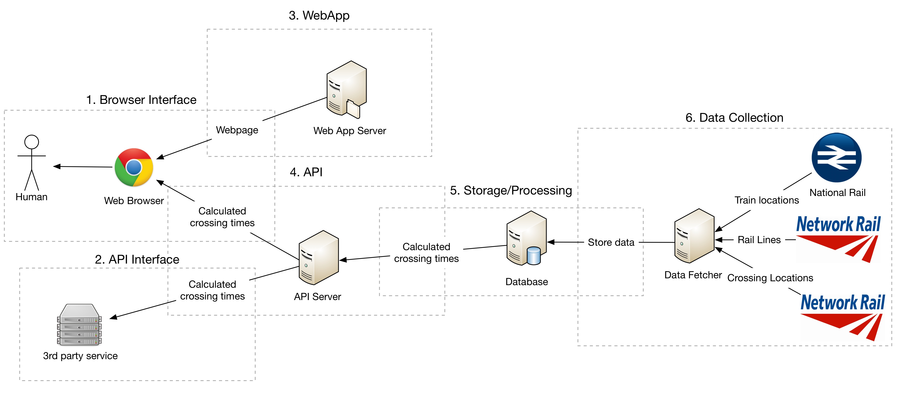

**V 1.0.0**
# Technical Overview
This document providers a more techincal indepth view of the system and how each component works and interacts with its neighbouring components.

### 1. Browser Interface
The primary access to the site and its data will be through a website accessible by a user using any internet enabled device such as a laptop, smart phone or tablet. This will work by providing a a web application from the application server which will then request data from the API server. We plan to support the top 4 major browsers, IE, Chrome, Safari and Firefox.

### 2. API Interface
This project will also allow users to access the train time data via the API directly which will mean creating a documenting this system. Users will not be rate limited all require an API key and will reply on a strong system architucre that could cope with any level of demand from the users. API access will allow other developers to create more apps with our data such as a a Navigiation app that facotors in crossing locations and times.

### 3. Web App
The web app will be the code that creates and interface for the browsers to allow humans users to interact with the data. It will use several of the latest techongilies that will effiect display to the use in an entitive monour data about each crossing. As specificed in [1. Browser Inteface](#1. Browser Interface) it will be cross browser and cross device so that it provides maximum accessibility.  
[A more technical overview can be read here.](Web App/Technical overview.md)

### 4. API
The API server will server data from the data base to the users and 3rd party services. It will be resonsible for read and validating the requests, as well as caching the requests for performance.

### 5. Storage/Processing
The database provides 2 main purposes. Firslty it will be storeing all the data for the crossing, as well as current and historical train times. Its second purpose is to do all the the anaylitsts on the data to calculate when which crossings will be up or down. Leaving this logic the in database will provide a massive performance gains in calculation times of repeat and new data requests.

### 6. Data Collection
The data collection service will be in charge off peridically collecting data from National Rail, Network Rail and OpenStreetMap, checking that the data is correct and storing it into the database.