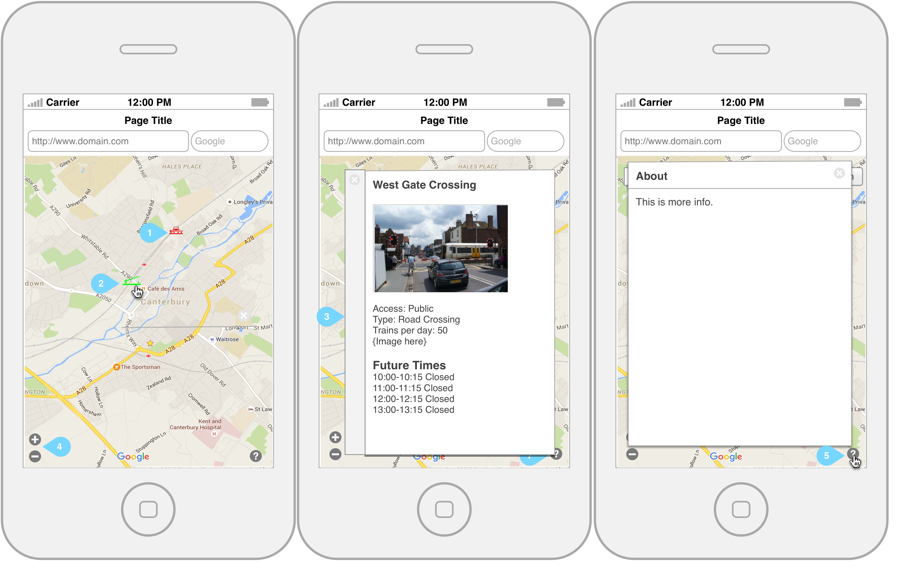

**V 1.1.1**
# UI Designs
### General
The interface is responsive so it scales to all screen sizes. Due to the simplicty of the design, the layout itself doesn't need to change as it scales.

## Interface testing
After building a mock of the user interface it was tested on a small group of people for usability as well as private testing with different data sets. 
As a result of the testing 3 changes were made:

- Search bar was removed - Due to the limited area of coverage, no one ever attempted to use this.
- More information bubble was made a model - This provided more room to display data, as the popup provided little space, this was particularly an issue on smaller devices.
- The "Go to my current location" button was removed as Google maps does not allow this with their API.

The UI is now overall slightly simplier which is possible as we went for a map based view which the user can also navigate manually.

## Interface

### Design V2

1) Closed icon is shown whenever a barrier is down. Using both an icon and colour - this improves accessibility.

2) Open icon is shown whenever a barrier is up, again making use of both an icon and colour.

3 & 4) When clicking on a crossing it opens a popup which shows the future open and closing times. This also includes a small description of the crossing with meta data.

6) The zoom icons provide a way to zoom in and out of the map

7) Clicking the ? icon opens up an about window showing user information about the app.

### Design V1

1) Search bar provides a way to search for any location in the UK and zoom straight to it.

2) Closed icon is shown when ever a barrier is down. Using both an icon and colour.

3) Open icon is shown when ever a barrier is up. Using both an icon and colour.

4) When clicking on an crossing it opens a popup which shows the futures open and close times. This will also include a small description of the crossing with meta data.

5) This is the commonly used icon for focusing on the users current location.

6) The zoom icons provide a way to zoom in and out off the map

7) Clicking the ? icon opens up an about window showing user information about the app.